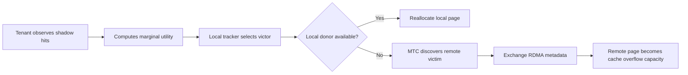

# MemExchange

MemExchange is a research prototype for **cloud-scale memory trading** in
multi-tenant in-memory caches. It extends Memcached so that cache tenants can
temporarily borrow unused memory from other tenants, including tenants on other
physical servers, while preserving the familiar Memcached interface for clients.

The system is designed for the common cloud scenario where memory is
over-provisioned for peak demand: one tenant may be evicting useful objects
because its cache is too small, while another tenant holds idle DRAM elsewhere
in the cluster. MemExchange turns that stranded capacity into a logical
cluster-wide memory pool and reallocates it according to measured cache utility.

## What MemExchange Does

- Estimates each tenant's memory demand online using Miss Ratio Curves (MRCs)
  built from shadow queues.
- Scores tenants by marginal utility, so memory goes to tenants that are
  expected to gain the most hit-rate improvement.
- Reclaims low-utility pages from over-provisioned tenants, first locally and
  then across the cluster.
- Uses RDMA as a remote overflow tier, allowing a tenant to store colder cache
  objects in memory physically owned by another server.
- Coordinates page transfers through the MemExchange Tracker Communication
  (MTC) protocol, avoiding a centralized broker.
- Keeps hot data local when possible while using remote memory to reduce cache
  misses for memory-constrained tenants.



## Paper and Results

MemExchange is described in the arXiv paper:

**[MemExchange: Cloud-Scale Memory Trading](https://arxiv.org/abs/2607.11579)**

AmirHossein Seyri, Abhisek Pan, and Balajee Vamanan

If you use this repository or build on MemExchange, please cite:

```bibtex
@misc{seyri2026memexchange,
  title = {MemExchange: Cloud-Scale Memory Trading},
  author = {Seyri, AmirHossein and Pan, Abhisek and Vamanan, Balajee},
  year = {2026},
  eprint = {2607.11579},
  archivePrefix = {arXiv},
  primaryClass = {cs.DC},
  doi = {10.48550/arXiv.2607.11579},
  url = {https://arxiv.org/abs/2607.11579}
}
```

The paper evaluates MemExchange with CloudSuite and mutilate on CloudLab,
including medium-scale experiments and a 100-server rack-scale deployment.
Headline results include:

- Up to **2.3x lower remote-access overhead** than TCP-based remote cache access.
- Up to **63.1% miss-rate reduction** for memory-constrained tenants under the
  Twitter workload compared with static Memcached.
- Roughly **50% higher cluster-wide memory utilization** in medium-scale
  experiments by reclaiming idle memory from over-provisioned tenants.
- **53 GB reallocated cluster-wide** in a 100-server experiment, including 32 GB
  served remotely over RDMA.
- **13.25% higher memory utilization at rack scale**, with most
  under-provisioned tenants reaching sustained high hit rates after convergence.

## Repository Layout

```text
MemExchange/
|-- src/                 # Modified Memcached / MemExchange implementation
|-- scripts/             # CloudLab deployment and experiment automation
|-- analysis/            # R scripts for paper figures and statistics
|-- benchmarks/          # Links and notes for benchmark repositories
|-- docs/                # FAQ and supporting documentation
|-- LICENSE
`-- README.md
```

Benchmark drivers and comparison systems are maintained as separate
repositories; see [benchmarks/README.md](benchmarks/README.md). The scripts in
this repository assume the CloudLab topology and paths used for the paper, so
they should be treated as reproducibility artifacts rather than turnkey
production tooling.

## System Overview

Each physical server runs a lightweight **Tracker** process and one or more
MemExchange tenants. The Tracker initializes a shared-memory region, tracks
tenant allocations, and coordinates local and remote memory trading.

Memory trading proceeds in two levels:

1. **Local trading:** if a memory-constrained tenant can benefit from more
   capacity, MemExchange first tries to reclaim a low-utility page from another
   tenant on the same server.
2. **Cluster-wide trading:** if local memory is insufficient, Trackers use MTC
   to find a remote victim tenant. The victim exposes a cleared page through
   RDMA, and the victor uses that page as remote cache capacity.

Remote pages are integrated into Memcached as an overflow tier. Local lookups
are attempted first; remote hits are served with one-sided RDMA reads, and
remote inserts use RDMA writes.

## Build

Install dependencies:

```bash
sudo apt update
sudo apt install -y \
    autotools-dev \
    autoconf \
    libevent-dev \
    librdmacm-dev \
    ibverbs-utils \
    scons \
    gengetopt \
    screen
```

If you are testing without hardware RDMA and plan to use Soft-RoCE/RXE, also
install:

```bash
sudo apt install -y rdma-core
```

Build MemExchange:

```bash
cd src/
./autogen.sh
./configure CFLAGS="-w"
make
```

Clean build artifacts:

```bash
make clean
```

## Running a Tracker

The tracker must be started before MemExchange tenants. It creates the
shared-memory region and controls whether the node participates in
cluster-wide memory trading.

Compile the tracker binaries from `src/`:

```bash
gcc -g -o tracker start_tracker.c shm_malloc.c -lrt -pthread
gcc -g -o stop_tracker stop_tracker.c shm_malloc.c -lrt -pthread
```

Usage:

```text
./tracker <shared_memory_MB> [tenant_share_1 tenant_share_2 tenant_share_3 tenant_share_4] <MTC_ON|MTC_OFF>
```

Example:

```bash
./tracker 32000 0.25 0.25 0.25 0.25 MTC_ON
```

- `MTC_ON` enables cluster-wide trading. Local tenants may borrow remote memory,
  and the node may lend idle memory to tenants on other servers.
- `MTC_OFF` restricts trading to local tenants on the same physical server.

When tenants finish, clean up the shared-memory region:

```bash
./stop_tracker
```

## Running Tenants

Start a MemExchange tenant similarly to Memcached:

```bash
./memcached -v -p 11212 -t 4 -m 4096 -G
```

The `-G` flag enables greedy mode, allowing a tenant to grow beyond its initial
allocation when MemExchange identifies useful additional capacity.

## Debugging Builds

AddressSanitizer (ASan) is useful for tracking memory corruption, use-after-free
bugs, and other allocator-related issues while developing or debugging
MemExchange.

Example ASan flags:

```makefile
CFLAGS += -fsanitize=address -fno-omit-frame-pointer
LDFLAGS += -fsanitize=address
```

For undefined behavior checks, use UBSan:

```makefile
CFLAGS += -fsanitize=undefined
LDFLAGS += -fsanitize=undefined
```

## Experiments and Reproducibility

The evaluation workflow used for the paper is split across this repository and
the benchmark repositories:

1. Configure CloudLab nodes and RDMA networking.
2. Start trackers and MemExchange tenants on cache servers.
3. Run CloudSuite or mutilate clients against the tenant set.
4. Collect logs, MTC statistics, latency, hit-rate, and utilization data.
5. Generate figures and statistical summaries with the R scripts in
   `analysis/`.

Useful entry points:

- [scripts/README.md](scripts/README.md): CloudLab setup, benchmark launchers,
  RPS sweeps, and MTC statistics logging.
- [benchmarks/README.md](benchmarks/README.md): modified CloudSuite, mutilate,
  and InfiniSwap repositories used in the evaluation.
- [analysis/README.md](analysis/README.md): R scripts for figures, summaries,
  and statistical analysis.
- [docs/README.md](docs/README.md): methodology notes and common questions.

## Soft-RoCE / RXE

MemExchange can be tested with Software RDMA on machines without RDMA-capable
NICs. Example setup:

```bash
echo "mlx5_core.rdma.2" | sudo tee /sys/bus/auxiliary/drivers/mlx5_ib.rdma/unbind
sudo rdma link add rxe_0 type rxe netdev enp65s0f0np0
rdma link
```

Adjust the network interface name for your machine.

## Notes

This is research software. Some scripts contain CloudLab-specific paths,
usernames, IP ranges, interface names, and experiment layouts. They are included
to make the evaluation workflow transparent, but they will need adjustment for
other environments.

The implementation is based on Memcached and retains the upstream Memcached
license in [LICENSE](LICENSE).
